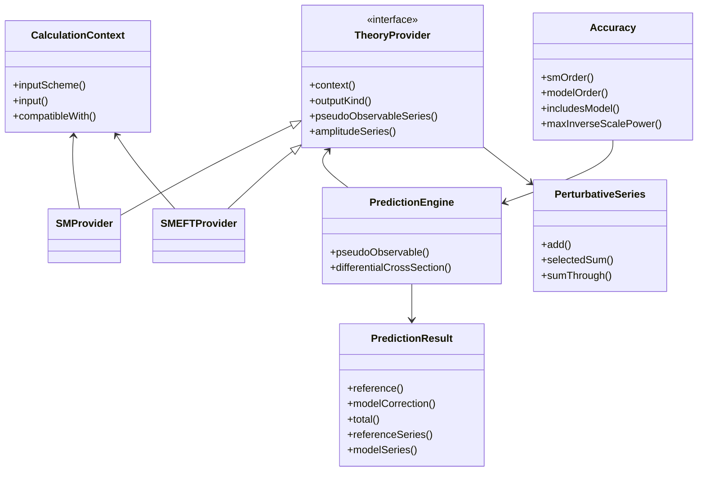
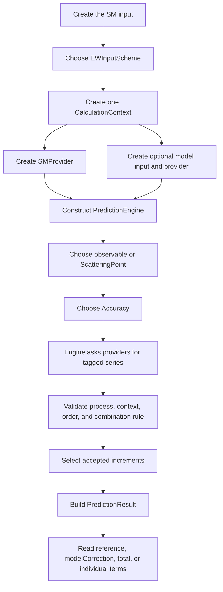

# Order-aware prediction engine

## Purpose

The prediction engine separates three questions that the original cumulative
class hierarchy mixed together:

1. Which theory supplies a contribution?
2. At which perturbative and inverse-scale order is it available?
3. How should the reference and model predictions be combined?

A user now builds one shared calculation context, attaches an SM provider and
optionally a model provider, selects an `Accuracy`, and receives a structured
`PredictionResult`. Changing from SM LO to NLO or NNLOPlus no longer requires
constructing a different public observable class.

This interface is additive. The original GRIFFIN classes remain available and
are used inside the current SM and SMEFT adapters.

## Directory and class structure

| Location | Responsibility |
|---|---|
| `prediction/EWInputScheme.h` | Input-scheme identity shared by all theories |
| `prediction/CalculationContext.h` | One input scheme plus one SM reference input |
| `prediction/Order.h` | Loop order, sector, QCD metadata, inverse-scale order, and requested accuracy |
| `prediction/PerturbativeSeries.h` | A list of tagged, labelled increments |
| `prediction/TheoryProvider.h` | Abstract source of pseudo-observable and amplitude series |
| `prediction/CombinationRule.h` | Meaning of combining the reference and model providers |
| `prediction/PredictionResult.h` | Reference, model correction, total, and both source series |
| `prediction/PredictionEngine.*` | Validation, selection, combination, and cross-section construction |
| `models/SMProvider.*` | Adapter from existing SM LO/NLO/NNLOPlus classes |
| `models/SMEFTProvider.*` | Adapter for linear tree-level dimension-six corrections |
| `xscmassless.*` | Shared process validation and massless cross-section algebra |

The principal relationships are:



## Calling workflow

The same call flow applies to the SM alone and to SM+SMEFT:



For a pseudo-observable, each provider directly returns a series of values.
For a differential cross section, providers return the `VV`, `AV`, `VA`, and
`AA` amplitude series. The shared massless builder then forms the selected SM
prediction and, for SMEFT, the strict tree-SM/tree-D6 interference.

## Minimal user example

```cpp
#include "SMvalG.h"
#include "models/SMEFTProvider.h"
#include "models/SMProvider.h"
#include "prediction/PredictionEngine.h"

using namespace griffin;
using namespace griffin::prediction;

SMval direct;
// Set the ordinary GRIFFIN SM inputs here.
SMvalGmu smInput(direct);

smeft::Input eftInput;
eftInput.setLambdaGeV(1000.0);
eftInput.setCphiWB(0.01);

CalculationContext context(EWInputScheme::GmuAlphaMZ, smInput);
SMProvider sm(context);
SMEFTProvider smeftModel(context, eftInput);

PredictionEngine prediction(
    sm, smeftModel, CombinationRule::linearEFT());

PredictionResult<Cplx> fa = prediction.pseudoObservable(
    PseudoObservable::FA,
    Fermion::muon,
    Accuracy::SMNNLOPlus_plus_ModelLO());

std::cout << fa.reference()       // selected SM NNLOPlus value
          << fa.modelCorrection() // linear SMEFT tree term
          << fa.total();          // their sum
```

`examples/testprediction.cc` is the executable version. It prints SM LO, NLO,
and NNLOPlus, followed by SMLO+SMEFTLO, SMNLO+SMEFTLO, and
SMNNLOPlus+SMEFTLO for both `FA(muon)` and
\(d\sigma(e^+e^-\to\mu^+\mu^-)/d\cos\theta\).

Build it with:

```bash
cmake -S . -B build -DGRIFFIN_BUILD_EXAMPLES=ON
cmake --build build --target testprediction
./build/examples/testprediction
```

## Orders and increments

`LoopOrder` currently has `LO`, `NLO`, and `NNLOPlus`. `NNLOPlus` means the
content of GRIFFIN's existing highest-order SM classes: nominal NNLO together
with selected known higher-order terms. It is not a claim that every
observable contains a complete uniform order beyond NNLO.

Every term has an `OrderTag`:

```text
sector              ReferenceSM or ModelCorrection
loopOrder           LO, NLO, or NNLOPlus
qcdOrder            metadata integer; not yet selectable by Accuracy
inverseScalePower   0 for SM, 1 for 1/Lambda^2, ...
```

Providers store increments, not repeated cumulative values. If the existing
classes return \(O_{LO}\), \(O_{NLO}\), and \(O_{NNLO+}\), `SMProvider`
stores:

```text
LO         O_LO
NLO        O_NLO - O_LO
NNLOPlus   O_NNLOPlus - O_NLO
```

The selected sum therefore reconstructs the requested cumulative result.
The label on each term is retained for inspection and future reporting.

Convenience accuracies are:

| Accuracy | Selected content |
|---|---|
| `SMLO()` | SM through LO |
| `SMNLO()` | SM through NLO |
| `SMNNLOPlus()` | SM through GRIFFIN NNLOPlus |
| `SMLO_plus_ModelLO()` | SM LO plus model LO through `1/Lambda^2` |
| `SMNLO_plus_ModelLO()` | SM NLO plus model LO through `1/Lambda^2` |
| `SMNNLOPlus_plus_ModelLO()` | SM NNLOPlus plus model LO through `1/Lambda^2` |

`Accuracy::smPlusModel()` can express other requests, but a provider must
actually supply the requested order. SMEFT NLO and `1/Lambda^4` are currently
rejected rather than silently approximated.

## Combination rules

The provider declares whether its output is a reference theory, an additive
correction, or a complete model. The combination rule makes the interpretation
explicit:

| Rule | Required model output | Meaning |
|---|---|---|
| `linearEFT()` | Additive correction | Add a model series truncated at exactly `1/Lambda^2` |
| `additiveCorrection()` | Additive correction | Add the selected correction without EFT-specific truncation semantics |
| `fullModelDifference()` | Full model | Add `model through modelOrder - reference through modelOrder` to the selected reference |
| `exactModel()` | Full model | Replace the selected reference value by the selected full-model value |

Only `linearEFT()` is implemented for the generic differential cross-section
path. The other rules already work for pseudo-observables and provide an
extension point for future models.

## Result structure

`PredictionResult<Value>` never hides the split between the reference and the
model:

```text
reference()        selected reference-theory value
modelCorrection()  selected correction or derived model difference
total()            reference + modelCorrection
referenceSeries()  all tagged reference increments returned by the provider
modelSeries()      all tagged model increments returned by the provider
```

This structure avoids extracting a model correction by subtracting two large
public totals. It also makes coefficient fits and order comparisons less
error-prone.

## Validation and lifetime contract

The engine validates the same domain before either an SM-only or an SM+model
cross section is evaluated. The current massless builder supports an electron
initial state and a different charged-fermion final state. Bhabha scattering,
neutrino final states, non-electron initial states, and invalid kinematics are
rejected with exceptions.

The context, providers, and input objects are non-owning views. In the example
above, `smInput`, `eftInput`, `context`, `sm`, and `smeftModel` must all remain
alive while `prediction` is used. They should also be treated as immutable
after provider construction. This is a lifetime contract, not an ownership
transfer.

## Adding a new theory provider

An internal developer should:

1. Derive a class from `TheoryProvider`.
2. Store or reference the shared `CalculationContext`.
3. Declare `ProviderOutputKind` correctly.
4. Return labelled `PerturbativeSeries<Cplx>` objects from both provider
   methods.
5. Tag every term with the correct sector, loop order, QCD order, and inverse
   scale power.
6. Never place the SM reference inside an additive-correction provider.
7. Add tests for unavailable orders, context mismatch, zero correction, and
   the chosen combination rule.

For a new scattering process, do not weaken the validation in
`MasslessFermionCrossSectionBuilder`. Add a process-specific observable
builder that owns its required channel basis and kinematics. Bhabha and
electron-neutrino production require this approach because their amplitude
structures are genuinely different.

## Current limits

The architecture records more information than is currently controllable.
In particular, QCD order is not selected by `Accuracy`, W-mass derivation
accuracy remains attached to the SM input object, and the SM cross-section
square still follows the cumulative-amplitude convention. These and other
release blockers are described in `KNOWN_ISSUES.md`.
